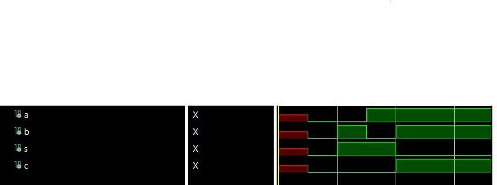

# Half Adder Example

The first source sets up the half adder entity and its behavior: There are two inputs a and b and two outputs s (sum) and c (carry out). The behavior shows that the sum = a xor b and the carry out is set to 1 when a and b --> 1.\
The half adder test bench is what drives the simulation. The simulation is initialized with undefined bits representing a systems state when its first powered on. Next every combination of input a and b is tested every 1ns to show its corresponding output.
# 4 to 1 Mux Example

