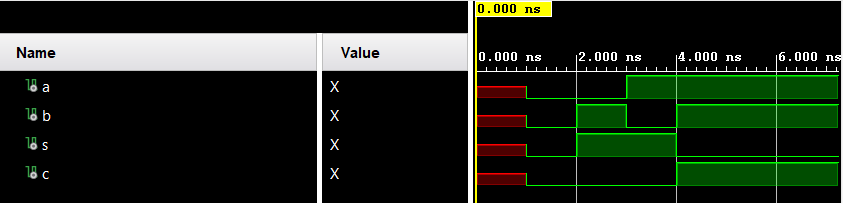
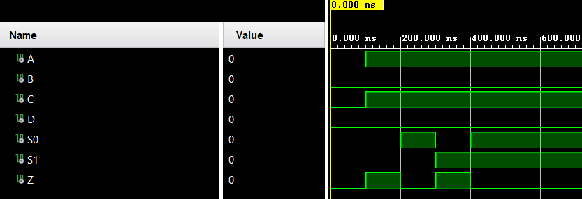

# Half Adder Example
\
The first source sets up the half adder entity and its behavior: There are two inputs a and b and two outputs s (sum) and c (carry out). The behavior shows that the sum = a xor b and the carry out is set to 1 when a and b --> 1.\
The half adder test bench is what drives the simulation. The simulation is initialized with undefined bits representing a system's state when it's first powered on. Next, every combination of input a and b is tested every 1 ns to show its corresponding output.
# 4 to 1 Mux Example
\
Similarly, the mux entity and behavior are defined in mux.vhdl. The mux has 4 inputs A B C and D and are defined by two bits S0 and S1 with a final output Z. For the behavior, Z is set to A when S0=0 and S1=0, Z is set to B when S0=1 and S1=0, Z is set to C when S0=0 and S1=1, and Z is set to D when S0=1 and S1=1.\
The mux test bench defines A and C = 1 and tests every combination of S0 and S1 inputs. The results show Z being set high when S0=0 and S1=0 corresponded to A and when S0=0 and S1=1 corresponded to C.
