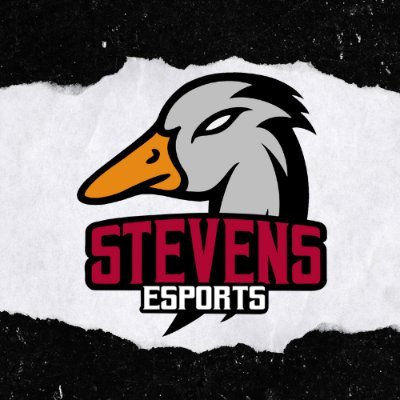
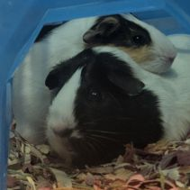

# **EE-322-Design-VI**
### Spring 2025
---
## About Me
- Electrical Engineer
  - *Embedded Systems Concentration* 
- Team Captain of Stevens Splatoon Esports Team

  

### Likes
- Nintendo videogames
- Summers on the beach
- Poke bowls
- My pet guinea pigs: Smores and Munchies

## [Labs](https://sit.instructure.com/courses/77142/assignments/557717)
1. GHDL and GTKWave
2. Command Line
3. Python
4. Django and Flask
5. Paho-MQTT
6. Node.js and Pystache
7. ThingSpeak and Google Sheets
8. Data Analysis
9. YANG
10. Blockchain

> "You are the master of your destiny: No one and nothing can come in between you and your destiny except you.”
> — Master Oogway

`git status`
